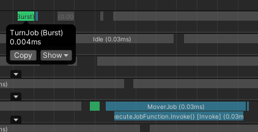
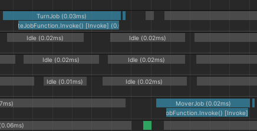

# Unity ECS Modding
#### February 25, 2025
This is an example guide for modding in Unity's Entity Component System (ECS) framework. The repository contains 2 example Unity projects using editor version 2022.3.39f1 and [Unity Entities](https://docs.unity3d.com/Packages/com.unity.entities@1.2/manual/index.html) version 1.2.3.
- The `ECSModdingHost_Advanced` project is an example *host* project, which represents the game to which you are adding modding capabilities.
- The `ECSModdingSDK_Advanced` project is an example *SDK* project, which represents the tool modders must use to mod your (host) game.

## General Information
The host project provides 3 systems:
1. `MoverSystem`: Applies a `MoverJob` to all entities with `MoverComponent` to move in a set direction at a set speed. This system and its components are grouped into a *moddable* folder/assembly and will be exposed to and usable by modders.
2. `BreatheSystem`: Applies a `BreatheJob` to all entities with `BreatheComponent` to periodically grow and shrink entities over time. This system and its components are grouped into a *protected* folder/assembly and will *not* be exposed modders.
3. `SpawnerSystem`: Spawns a set number of prefab entities at random locations and initializes their values using the `SpawnerComponent`. This system and its components are also *protected* like the BreatheSystem.

The example mod provides 2 systems:
1. `TurnSetupSystem`: Applies a `TurnSetupJob` to all entities with a `MoverComponent` and without a `TurnComponent` to give those entities a `TurnComponent`.
2. `TurnSystem`: Applies a constant directional change to all entities with both a `MoverComponent` and `TurnComponent`.

The installation steps describe how to set up the host and SDK projects in such a way that certain code from the host project is protected from modders and other code is available for modders to use. In this example, the `MoverSystem` and `MoverComponent` are visible to modders, and we use that to apply a new component (`TurnComponent`) and system (`TurnSystem`) to our game.

Turn Mod Enabled             |  Turn Mod Disabled
:-------------------------:|:-------------------------:
 | 

## Installation
### General Setup:
1. Clone the repository:
```
git clone https://github.com/orcsune/UnityModdingECS.git
```
2. Open Unity Hub.
3. `Add > Add project from disk`. Navigate to `UnityModdingECS/Advanced/ECSModdingHost_Advanced`. Do the same with `ECSModdingSDK_Advanced`.

### Setup Host Project:
1. Open `ECSModdingHost_Advanced` using Unity 2022.3.39f1.
2. Open `Assets/Scripts/Modding/ModLoader.cs` and change the `ModPath` field to a folder where you want your mods to go.
3. Create the folder at `ModPath`.
4. In the `ModPath` folder, create an empty `mods.meta` file.
5. In the `ModPath` folder, create a new folder called `IntegratedMod` (next to `mods.meta`).
6. In the `IntegratedMod` folder, create a new file called `manifest.json` with the following contents. This file can also be copied from `Advanced/Resources/IntegratedMod/manifest.json`:
```
{
  "Name": "Turn Mod",
  "Version": "1.0",
  "UseAllDLLs": true,
  "IncludedDLLs": [],
  "ExcludedDLLs": [],
  "BurstDLLs": [
    "lib_burst_generated.dll"
  ],
  "Enabled": true,
  "ModPriority": 0
}
```
7. This defines a new mod called "Turn Mod" with a version of "1.0". We want to include all DLLs by default, so `UseAllDLLs` is true. We include `lib_burst_generated.dll` in `BurstDLLs`, which causes this specific DLL to not be loaded with `Assembly.LoadFile`, but instead with `BurstRuntime.LoadAdditionalLibrary`. Finally, `Enabled` is true, so mod loading actually occurs for this mod.
8. Open the `SampleScene.unity` scene.
9. Go to `Assets/BuildConfigs` and build using the `TestBuild` configuration. By default, this should provide a build folder at `ECSModdingHost_Advanced/Builds/ModdingBuild`.

### Setup SDK Project:
1. Open `ECSModdingSDK_Advanced` using Unity 2022.3.39f1.
2. From `ECSModdingHost_Advanced/Builds/ModdingBuild/ECSModdingHost_Advanced/Managed`, copy the `MyGame.Moddable.Runtime.dll` file into `ECSModdingSDK_Advanced/Assets/`. This gives your SDK project knowledge about all the exposed components from your host project without giving any information about protected components, systems, or utilities.
3. Create a build by going to the top bar menu and selecting `Modding > Export Mod`.
4. Enter name "Turn Mod" and then press "Build and Export". This should default to exporting to the `TempBuild` folder.
5. Go to the `ECSModdingSDK_Advanced/TempBuild/Turn Mod_Data/Managed/` folder and copy the `MyGame.Modding.IntegratedMod.dll` file to the `<ModPath>/IntegratedMod/` folder from the host's `ModLoader`. The managed code from this DLL will be loaded because because `UseAllDLLs` is true in the mod manifest.
6. Go to the `ECSModdingSDK_Advanced/TempBuild/Turn Mod_Data/Plugins/x86_64/` folder and copy the `lib_burst_generated.dll` file to the `<ModPath>/IntegratedMod/` folder from the host's `ModLoader`. The bursted code from this DLL will be loaded because `BurstDLLs` includes `lib_burst_generated.dll` in the mod manifest.

### Testing the Mod:
1. Go to `ECSModdingHost_Advanced/Builds/ModdingBuild` and run the game.
2. There should be some debug output, but no exceptions. If any exceptions are thrown, something went wrong.
3. The mod is working if you can see the objects moving in circles. They should also be growing and shrinking periodically.
4. In the Unity editor, open the Profiler and connect it to the running standalone instance. If the "TurnJob" specified in the mod is green/Bursted, then you know the Burst loading also works. If burst did not work, then the "TurnJob" should be blue on the timeline. You can simulate no burst by removing `lib_burst_generated.dll` from the mod folder as well as from "BurstDLLs" in the `manifest.json`.
5. If you were to disable the mod by changing `Enabled` to false in manifest.json, then you should see the same objects growing and shrinking and moving right. The Turn Mod causes the objects to turn as they move, so without the mod, you should see them move right off the screen.

### Test Examples
#### Turn Mod Functionality
When the Turn Mod is enabled, the `TurnSystem` and `TurnJob` operate to change the direction of moving objects by a constant rate. When the mod is disabled, the normal game movement takes effect without the turning from the mod.
Turn Mod Enabled             |  Turn Mod Disabled
:-------------------------:|:-------------------------:
 | 

#### Burst Functionality
Burst Enabled             |  Burst Disabled
:-------------------------:|:-------------------------:
 | 

## Limitations
There are several limitations to the setup presented here:
- **System Limitations:** [ISystems](https://docs.unity3d.com/Packages/com.unity.entities@1.2/manual/systems-isystem.html) are not yet supported. If you want to mod in a system, it must inherit from [SystemBase](https://docs.unity3d.com/Packages/com.unity.entities@1.2/manual/systems-systembase.html).
- **No Hot Reloading:** Currently, DLLs must be loaded before much ECS initialization logic, so this method requires that the user restart the standalone player to apply new mod changes.
- **No Editor Testing:** There is a type cache that does not take external DLLs into account in the editor, so mods are difficult to test without a build.
